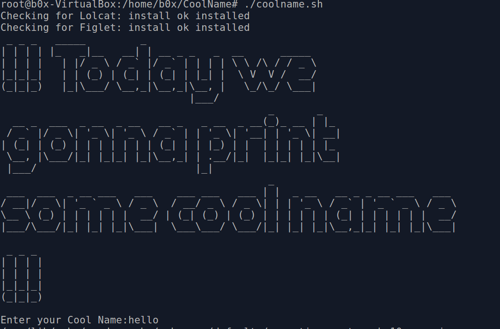
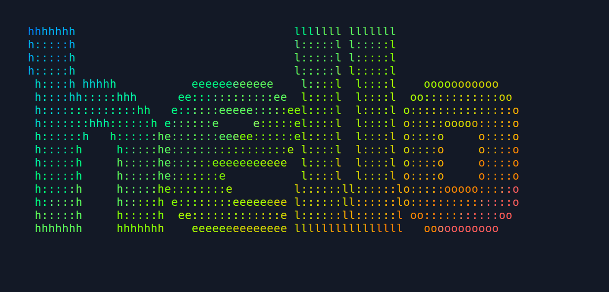

# CoolName
Print Cool ascii characters in Linux cli using figlet and some colours borrowed from lolcat.
  
First give executable permissions to "coolname.sh" by <b>chmod +755 coolname.sh</b>  
Run the <b>coolname.sh</b> as root. 
 
 

 

